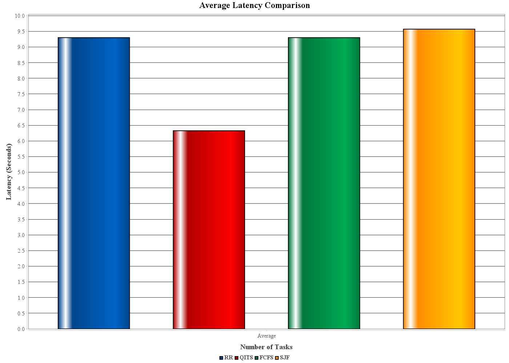

# Quantum-Inspired Task Scheduling (QITS) for Edge Computing in Smart Cities
 
Research implementation accompanying the paper *"Quantum-Inspired Task Scheduling For Edge Computing in Smart Cities"* by Nadia Shamshad and Qaisar Shaheen.
 
## Abstract
 
Smart city IoT applications demand low-latency, energy-efficient task scheduling across heterogeneous edge/fog nodes — a workload conventional schedulers struggle to handle at scale. This paper proposes **QITS (Quantum-Inspired Task Scheduling)**, a fog-edge scheduling framework that seeds a Quantum-Inspired Particle Swarm Optimization (QPSO) population using an SJF-based heuristic initialization, then applies probabilistic position updates to dynamically assign tasks to fog nodes. The framework is implemented on the iQuantum simulation toolkit and evaluated against FCFS, SJF, and Round Robin using workloads derived from the Google Cluster Trace 2019 dataset.
 
**Headline results:** up to **86% lower latency**, **59.2% lower energy consumption**, and **96.3% better load balancing** than the three baseline algorithms.
 
## System Architecture
 
The system follows a three-layer IoT → Fog → Cloud architecture:
 
- **IoT Layer** — traffic monitoring, smart surveillance, and environmental sensing devices that continuously generate tasks.
- **Fog Layer** — distributed fog nodes near end users, executing latency-sensitive tasks.
- **Cloud Layer** — large-scale resources for tasks that can't be handled locally at the fog layer.

 
## The QITS Algorithm
 
QITS combines an SJF-seeded initialization with Quantum-Inspired Particle Swarm Optimization:
 
1. **SJF-based initialization** — instead of random particle initialization, tasks are sorted by estimated execution time (Shortest Job First) and mapped to nodes round-robin, then perturbed slightly for population diversity. This accelerates convergence versus fully random QPSO seeding.
2. **QPSO position update** — particles (candidate task-to-node mappings) are updated using: `X_new = mBest ± δ·|pbest − X|·ln(1/u)`, where `u ~ U(0,1)` and δ is the contraction coefficient (0.75).
3. **Multi-objective fitness function** — `Fitness = α·Latency + β·Energy + γ·Load + Penalty`, with empirically tuned weights α=0.5, β=0.3, γ=0.2.
4. **Discretization & feasibility repair** — continuous QPSO particle positions are mapped to discrete node indices via `Node(Tᵢ) = ⌊|Xᵢ| mod M⌋`; if a chosen node can't meet a task's CPU/memory requirements, the task is reassigned to the least-loaded feasible node, or offloaded to the cloud layer if none exist.

 
**Complexity:** O(P × N × I) time, O(P × N) space, where P = population size, N = number of tasks, I = iterations.
 
## Experimental Setup
 
| Component | Value |
|---|---|
| Simulation framework | iQuantum (Java, JDK 22) |
| Fog nodes | 20 heterogeneous nodes (1000–2100 MIPS) |
| Dataset | Google Cluster Trace 2019, filtered to 10,000 tasks (500–3000 MI, 256–1024 MB) |
| Task loads tested | 100, 200, 300, 500, 800, 1000, 1500 tasks |
| Particles (P) | 30 |
| Max iterations | 100 |
| QPSO contraction coefficient (δ) | 0.75 |
| Fitness weights (α, β, γ) | 0.5, 0.3, 0.2 |
| Validation | 30 independent runs per configuration, 95% CI, paired t-test (p < 0.001) |
 
Data was split 80/20 — 8,000 tasks for final evaluation, 2,000 for parameter tuning (grid search over α, β, γ, δ).
 
## Results
 
### Latency
 
QITS scales sub-linearly with task volume, consistently outperforming all baselines:
 
| Tasks | QITS | FCFS | SJF | RR |
|---|---|---|---|---|
| 100 | 17.72 s | 24.15 s | 25.81 s | 24.15 s |
| 500 | 91.77 s | 116.01 s | 117.85 s | 116.01 s |
| 1500 | 296.16 s | 346.10 s | 346.10 s | 346.10 s |
 

 
### Energy Consumption
 
| Tasks | QITS | FCFS | SJF | RR |
|---|---|---|---|---|
| 100 | 2.09 J | 4.23 J | 4.79 J | 4.23 J |
| 500 | 5.37 J | 8.05 J | 8.38 J | 8.05 J |
| 1500 | 13.32 J | 17.71 J | 17.71 J | 17.71 J |
 

 
### Load Balancing
 
QITS keeps load imbalance roughly an order of magnitude lower than every baseline at every task volume:
 
| Tasks | QITS | FCFS | SJF | RR |
|---|---|---|---|---|
| 100 | 7.05×10⁻⁵ | 3.22×10⁻⁴ | 3.22×10⁻⁴ | 3.22×10⁻⁴ |
| 800 | 1.90×10⁻⁵ | 3.38×10⁻⁴ | 3.38×10⁻⁴ | 3.38×10⁻⁴ |
| 1500 | 1.58×10⁻⁵ | 3.45×10⁻⁴ | 3.45×10⁻⁴ | 3.45×10⁻⁴ |
 

 
### Overall Improvement Summary
 
| Metric | vs. FCFS | vs. RR | vs. SJF |
|---|---|---|---|
| Latency | 86.1% ↓ | 85.9% ↓ | 85.3% ↓ |
| Energy | 59.2% ↓ | 59.2% ↓ | 57.8% ↓ |
| Load Imbalance | 96.3% ↓ | 96.3% ↓ | 96.3% ↓ |
 
All improvements are statistically significant (paired t-test, 30 runs, p < 0.001).
 

 

 

 
## Why FCFS and Round Robin Look Identical
 
Under this experimental configuration (20 heterogeneous nodes, Poisson task arrivals, uniformly sampled resource demands), FCFS and Round Robin produce identical latency, energy, and load-balancing values. This is a property of this specific setup — front-loading in SJF gets neutralized within each Round Robin cycle at this node count — not a general equivalence between the algorithms.
 
## Scalability
 
Simulations covered 10–1500 tasks across up to 20 fog nodes. Latency growth was sub-linear, energy growth was more moderate than the baselines' steeper curves, and load balance held up at higher task volumes. Validation at larger scales (hundreds of nodes, thousands of tasks) is identified as future work — the current results are a proof of concept at this scale, not a claim of unlimited scalability.
 
## Repository Structure
 
```
MainSimulation.java     — experiment driver: runs all 4 schedulers across 7 task loads
comparison.csv          — raw output metrics per algorithm / task count
MQT-Set*.csv            — quantum circuit benchmark datasets (task profile source)
iquantumDataGen.ipynb   — dataset generation notebook
p4j.ipynb               — Python–Java bridge for analysis
images/                 — figures referenced in this README
```
 
## Built On
 
This project extends the [iQuantum toolkit](https://github.com/Cloudslab/iQuantum) from the Cloud Computing and Distributed Systems (CLOUDS) Laboratory, University of Melbourne.
 
## Future Work
 
- Validate at realistic scale: 20+ fog nodes and 1,000+ tasks.
- Explore reinforcement-learning-based adaptive weight tuning for the fitness function under highly dynamic workloads.
- Incorporate real-world edge computing datasets beyond Google Cluster Trace 2019 to test generalizability.
## Citation
 
If you use this work, please cite:
 
> Shamshad, N., & Shaheen, Q. *Quantum-Inspired Task Scheduling For Edge Computing in Smart Cities.*
 
