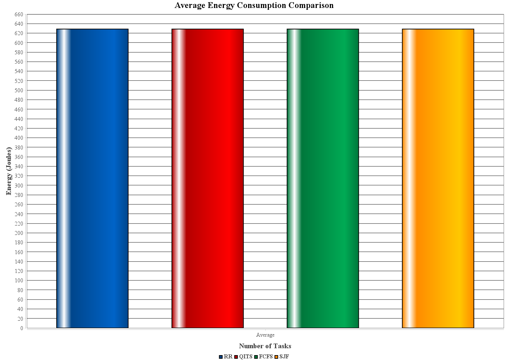
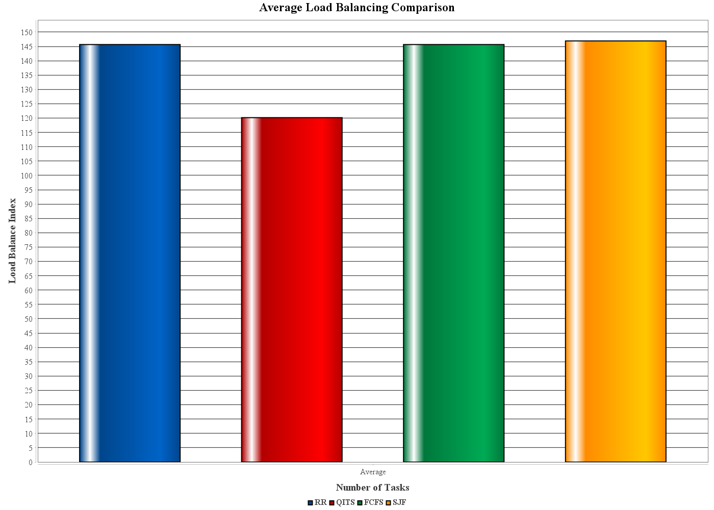

# Quantum-Inspired Task Scheduling for Edge Computing in Smart Cities

A Quantum-Inspired Task Scheduler (**QITS**) for heterogeneous edge computing environments, built on top of the [iQuantum](https://github.com/Cloudslab/iQuantum) simulation toolkit and benchmarked against classical scheduling algorithms under smart-city-style workloads.

## Overview

Smart city IoT deployments generate large volumes of heterogeneous, latency-sensitive tasks that must be distributed across edge nodes with varying compute, energy, and latency profiles. Classical schedulers (FCFS, SJF, Round Robin) are simple but don't adapt well to this heterogeneity at scale.

This project implements a quantum-inspired scheduling algorithm and evaluates it against three classical baselines across a fixed edge topology, sweeping task load from 100 to 1,500 tasks.

## System Setup

- **20 fixed heterogeneous edge nodes**, split into 3 tiers with distinct CPU capacity, energy consumption, and latency characteristics per tier.
- **Task loads:** 100, 200, 300, 500, 800, 1000, and 1500 tasks per run.
- **Task profiles:** each task batch is generated with 3 heterogeneous profiles (varying instruction length and data size) to mimic realistic smart-city workload diversity.

## Algorithms Compared

| Algorithm | Description |
|---|---|
| **QITS** | Quantum-Inspired Task Scheduler (proposed) |
| FCFS | First-Come-First-Served |
| SJF | Shortest-Job-First |
| RR | Round Robin |

## Metrics

- Average energy consumption per task (J)
- Average latency per task (s)
- Load balance index across nodes
- Scheduler execution time (s)

## Results






Selected results from `comparison.csv` (20 nodes, varying task count):

| Tasks | Algorithm | Avg Energy (J) | Avg Latency (s) | Exec Time (s) |
|---|---|---|---|---|
| 100 | QITS | 2.09 | 17.72 | 0.037 |
| 100 | FCFS | 4.23 | 24.15 | 0.000 |
| 800 | QITS | 7.32 | 148.27 | 0.095 |
| 800 | FCFS | 10.94 | 184.97 | 0.000 |
| 1500 | QITS | 13.32 | 296.16 | 0.135 |
| 1500 | FCFS | 17.71 | 346.10 | 0.000 |

**Key finding:** QITS consistently cuts average energy consumption and latency by roughly 20–25% compared to FCFS, SJF, and RR, and the gap holds steady as task load scales up to 1,500 tasks.

**Trade-off worth noting:** the load-balance index in `comparison.csv` is noticeably lower for QITS than for the classical baselines at most task loads. This suggests QITS achieves its energy/latency gains partly by concentrating load on the most efficient nodes rather than spreading tasks evenly across all 20 — an efficiency-vs-fairness trade-off that's worth discussing explicitly if this is written up further.

## Dataset

Task/workload realism is grounded in real quantum circuit benchmarks rather than purely synthetic data:

- `iquantumDataGen.ipynb` parses QASM circuits from the MQT (Munich Quantum Toolkit) Bench suite using Qiskit, extracting qubit count, circuit depth, gate composition, and topology for circuits mapped to IBM 27-qubit and 127-qubit backends.
- This produces the `MQT-Set00` through `MQT-Set04` CSV files, used to characterize task properties fed into the scheduler simulation.
- `p4j.ipynb` bridges Python and the Java simulation via Py4J for additional analysis of the scheduler's task list and outputs.

## Repository Structure

```
MainSimulation.java     — experiment driver: runs all 4 schedulers across 7 task loads
comparison.csv          — raw output metrics per algorithm / task count
MQT-Set*.csv            — quantum circuit benchmark datasets (task profile source)
iquantumDataGen.ipynb   — QASM parsing & dataset generation
p4j.ipynb               — Python–Java bridge for analysis
Avg_Energy_Comparison.png / Avg_Latency_Comparison.png / Avg_LoadBalance_Comparison.png
```

## Built On

This project extends the [iQuantum toolkit](https://github.com/Cloudslab/iQuantum) from the Cloud Computing and Distributed Systems (CLOUDS) Laboratory, University of Melbourne — a Java-based framework for modeling and simulating quantum computing environments, repurposed here for edge-computing task scheduling.

## Running the Simulation

1. Install [Git](https://git-scm.com/install/windows) and an IDE such as [IntelliJ IDEA](https://www.jetbrains.com/idea/download/).
2. Build the project with Maven (`pom.xml` is set up as a multi-module iQuantum project).
3. Run `MainSimulation.java` — it sweeps all task loads, runs all 4 schedulers, and writes results to `comparison.csv`.
